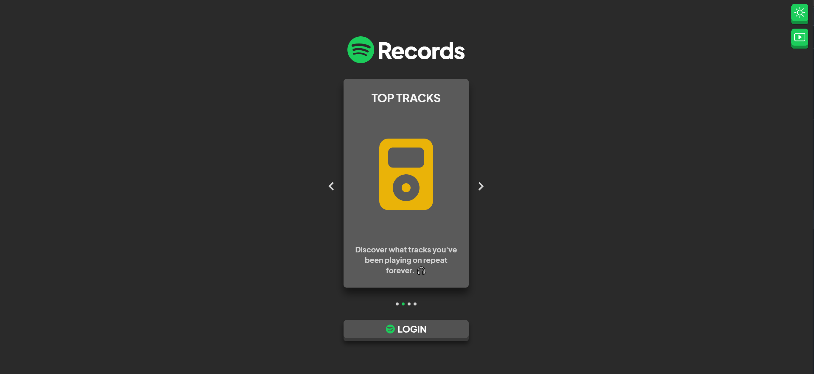

# Spotify Records

> A Spotify web application that displays your top tracks/top artists and creates a playlist based on user's Spotify history.

## 🎥 Live Demo
> https://spotify-records.com/demo

## 🚀 Objective

> To implement OAuth and work with a third-party API.

## 📸 Screenshots

<ul style="display:flex flex-direction:column">
 

 
     
</ul>

### Tablet/Mobile Design

<ul style="display:flex">
  
  
</ul>

## ⚙ Technologies

-  React
-  Typescript
-  Next.js
-  Spotify API


## 🛠 Installation and Setup

Clone down this repository. You will need node and npm installed globally on
your machine.

```
$ git clone https://github.com/jonathancarpena/spotify-records.git
```

1. Install project folder `npm install`
2. Visit https://developer.spotify.com/dashboard/ and create a new app
3. Input an Application Name and Description
4. Website input "http://localhost:3000/"
5. Redirect URIs input "http://localhost:3000/dashboard"
6. (Important) Open "Users and Access", add a Spotify User (limit is 25)

### Environment Variables

To run this project, you will need to add the following environment variables to
your `.env` file inside the server folder.

`NEXT_PUBLIC_CLIENT_ID`: Retrieve Client ID from your Spotify Dashboard

`NEXT_PUBLIC_CLIENT_SECRET`: Retrieve Client Secret from your Spotify Dashboard

`NEXT_PUBLIC_REDIRECT_URI`: Retrieve Redirect URI from your Spotify Dashboard

### Scripts

Development mode. Open http://localhost:3000 to view it in the browser.

```
npm run start
```
